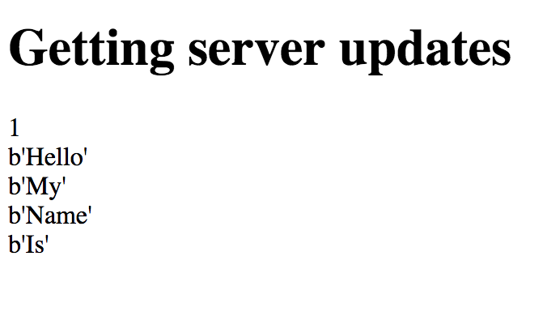

# Server Sent Event example using Redis.

## Install Redis
If you are using Mac OS, you can use `brew` like below.

```console
$ brew install redis
```

## Clone this repository for test
```console
$ git clone git@github.com:liks79/sse-redis-pubsub.git
```

## Install required packages
In this example for `python 3` environment.
`virtualenv` or `pyenv` is recommended.
```console
pip install -r requirements.txt
```

## Take look around.

### 1.Run redis-server
Run `redis-server` for installation confirm. 
```console
$ redis-server
```

### 2.Run server
```console
$ gunicorn sse:app --worker-class gevent --bind 127.0.0.1:8000
```
* output
```
[2018-10-29 11:05:16 +0900] [25846] [INFO] Starting gunicorn 19.8.1
[2018-10-29 11:05:16 +0900] [25846] [INFO] Listening at: http://127.0.0.1:8000 (25846)
[2018-10-29 11:05:16 +0900] [25846] [INFO] Using worker: gevent
[2018-10-29 11:05:16 +0900] [25859] [INFO] Booting worker with pid: 25859

```

### 3.Open the web page

You can open `sse.html` file in your browser. You may need CORS plugin like below.
* https://chrome.google.com/webstore/detail/cors/dboaklophljenpcjkbbibpkbpbobnbld

Or, you can see the following error messages on your console window.
```
Access to resource at 'http://localhost:8000/stream' from origin 'null' has been blocked by CORS policy: No 'Access-Control-Allow-Origin' header is present on the requested resource.
``` 


### 4.Run redis-cli and type some messages
```console
$ redis-cli
```
* output
```
127.0.0.1:6379>
127.0.0.1:6379> PUBLISH sse_channel "Hello"
(integer) 1
127.0.0.1:6379> PUBLISH sse_channel "My"
(integer) 1
127.0.0.1:6379> PUBLISH sse_channel "Name"
(integer) 1
127.0.0.1:6379> PUBLISH sse_channel "Is"
(integer) 1
127.0.0.1:6379>
```

### 5.Check your browser.
You can see below screen.


